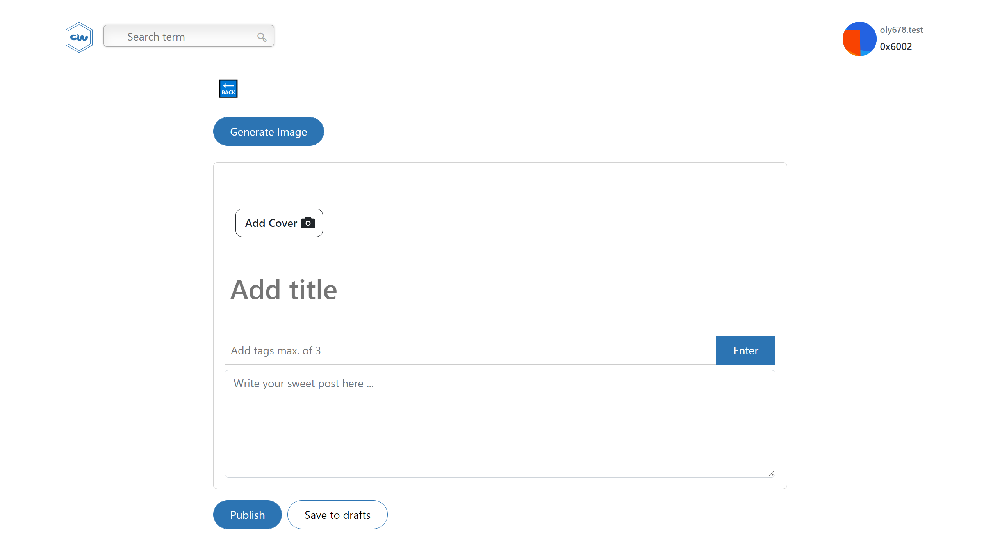

# **OVERVIEW**

## Project Name: chainWrite

## chainWrite is a social media blogging Dapp integrated with lens protocol & deployed on Polygon Mumbai

## Our Mission: To empower users to own and control their own data and online identity

 - *To create an account as a new user, please ensure you have matic testnet token to complete transaction*

 - *Profile creation for new user takes about 1-2 hrs, **while waiting for your profile to get created, you can only login to chainWrite platform to read blogs & once your profile is created successfully you will have access to all of the available** features*

- chainWrite Link: https://www.chainwrite.xyz/

#### LENS PROTOCOL is a composable and decentralized social graph. It lets creators take ownership of their content wherever they go in the digital garden of the decentralized internet, It functions on the polygon Proof Of Stake Blockchain ecosystem. You can read more here [Lens Protocol](https://www.lens.dev/) to learn more about thel Lens protocol

### Tech Stack : NuxtJs, VueJs, Ethers, GraphQl, Html, Css, BootstrapVue, web3.storage

#### Prerequisites: Javascript, VueJs, knowledge of web3

#### Available Features on chainWrite
        * Link:connecting to metamask
        * signing up to create a profile for new users 
        * Logging in for returning userswho already has ana account
        * Reading recommended blogpost
        * Viewing of user profile
        * Adding 👍 &  👎 reaction to post
        * Creating blogpost, saving post to draft, saving post for future readings

#### Future implementation
        * Provide an option for users to upload a video as cover while creating post using [Livepeer.js](https://docs.livepeer.org/)
        * Adding comment reaction on blogpost
        *Seaching through blogs
       
        
#### Screenshot of landing page


#### Screenshot of blog homepage


#### Screenshot of user profile-page


#### Screenshot of create post page



#### How to run project locally

# Nuxt 3 Minimal Starter

Look at the [Nuxt 3 documentation](https://nuxt.com/docs/getting-started/introduction) to learn more.

## Setup

Make sure to install the dependencies:

```bash
# yarn
yarn install

# npm
npm install

# pnpm
pnpm install --shamefully-hoist
```

## Development Server

Start the development server on http://localhost:3000

```bash
npm run dev
```

## Production

Build the application for production:

```bash
npm run build
```

Locally preview production build:

```bash
npm run preview
```

Check out the [deployment documentation](https://nuxt.com/docs/getting-started/deployment) for more information.
