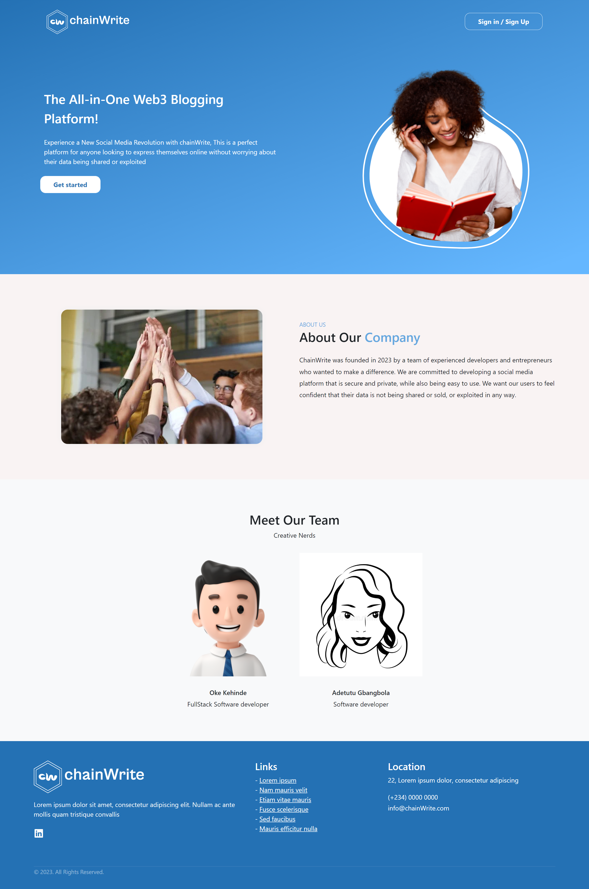

# **OVERVIEW**

## Project Title: chainWrite

## chainWrite is a social media blogging Dapp deployed on Polygon Mumbai & integrated with lens protocol, LivePeer & Push protocol. You can read more about the following framework below

 ##### Lens Protocol[Lens Protocol](https://www.lens.dev/)
##### Livepeer Protocol [Livepeer](https://livepeer.org/)
##### Push Protocol [Push Protocol](https://push.org/)

## chainWrite Mission: To empower users to own and control their own data and online identity

 - *To **create a blogpost, please ensure you have matic testnet token to complete** transaction*

 <!-- - *Profile creation for new user takes about 1-2 hrs on Lens, **while waiting for your profile to get created, you can only login to chainWrite platform to read blogs, view users profile & once your profile is created successfully you will have access to all of the available features e.g creating your blogpost, adding like & unlike reaction to post, view blogpost &** more* -->

- chainWrite Live-Link: https://www.chainwrite.xyz/

<!-- #### LENS PROTOCOL: is a composable and decentralized social graph. It lets creators take ownership of their content wherever they go in the digital garden of the decentralized internet, It functions on the polygon Proof Of Stake Blockchain ecosystem. You can read more here [Lens Protocol](https://www.lens.dev/) -->

### chainWrite Frontend Tech Stack : NuxtJs, VueJs, pinia(state mgt.) Ethers, GraphQl, Html, Css, BootstrapVue, web3.storage.

### chainWrite Backend Tech Stack : NodeJs, Express, MongoDb
<!-- ### The backend is use to track users that their profile has been created but still pending -->
### Backend Github Link: 
- chainWrite Backend : https://github.com/okeken/chainwrite-backend

#### Prerequisites: Javascript, VueJs, knowledge of web3

<!-- - Connect to your wallet -->

 <!-- Available Features on chainWrite -->
#### Available Features on chainWrite
        - Connect to your wallet
        - Creation of profile on Lens for new users
        - Logging in for returning users who already has an account
        - Read recommended blogpost
        - Viewing of user profile
        - Adding 👍 &  👎 reaction to post
        - Creating blogpost(Text) (user can either generate images base on request on the post creation page , with option to select their preferred from the carousel imags or add their own cover image from their device )
        - Users can upload videos/gif as cover instead of using images. This is achieved through [Livepeer.js 
        - Saving post to draft

 #### Future implementation
        - Adding comment reaction on blogpost
        - Seaching through blogs
        - Saving post for future readings
        - Notification modal to alert users of new posts
        - Settings to edit users profile page
        - Implement the follow user reaction
        - Minting post as NFTs
       
        
#### Screenshot of landing page


#### Screenshot of blog homepage


#### Screenshot of user profile-page


#### Screenshot of create post page


#### Screenshot of creating post page


#### You can generate images for your post creation cover photos, its a carousel image with options you can select from.


# How to run chainWrite locally

## Setup

Make sure to install the dependencies:

```bash
# yarn
yarn install

# npm
npm install

# pnpm
pnpm install --shamefully-hoist
```

## Development Server

Start the development server on http://localhost:3000

```bash
npm run dev
```

## Production

Build the application for production:

```bash
npm run build
```

Locally preview production build:

```bash
npm run preview
```
