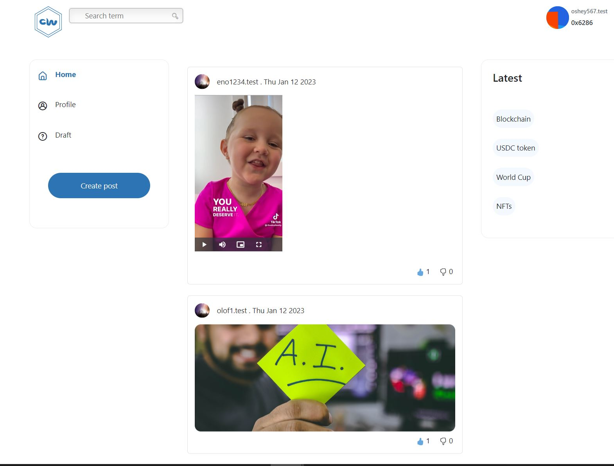

## A social media blogging Dapp integrated with lens protocol [Lens Protocol](https://www.lens.dev/), 

### Tech Stack : NuxtJs, VueJs, Ethers, GraphQl, Html, Css, BootstrapVue, web3.storage

### Deployed network : Polygon Mumbai

- To create an account please ensure you have a matic testnet token to complete transaction

- Link: https://chainwrite.netlify.app/

#### Available Features
        * Link:connecting to metamask
        * signing up to create a profile inorder to login & read post, logging in if you already have an account
        * Logging in if you already have an account
        * Viewing recommended post, user profile
        * Adding Like (👍) & Dislike (👎) reaction to post
        * Link:Logging in to blog page to read blogs
        * Link:creating post, saving post to draft, saving post for future readings

##### Currently working on
        * writing comment on post
        * writing comment on post
        
#### Things to work on next
        * Implement an option for users to uplaod a video as cover while creating post using [Livepeer.js](https://docs.livepeer.org/)
        * writing comment on post
        * Link: Seaching through blogs
       
        
#### Screenshot of homepage, registration page & blog page shown below


<!-- 
 -->


#### How to run locally

# Nuxt 3 Minimal Starter

Look at the [Nuxt 3 documentation](https://nuxt.com/docs/getting-started/introduction) to learn more.

## Setup

Make sure to install the dependencies:

```bash
# yarn
yarn install

# npm
npm install

# pnpm
pnpm install --shamefully-hoist
```

## Development Server

Start the development server on http://localhost:3000

```bash
npm run dev
```

## Production

Build the application for production:

```bash
npm run build
```

Locally preview production build:

```bash
npm run preview
```

Check out the [deployment documentation](https://nuxt.com/docs/getting-started/deployment) for more information.
